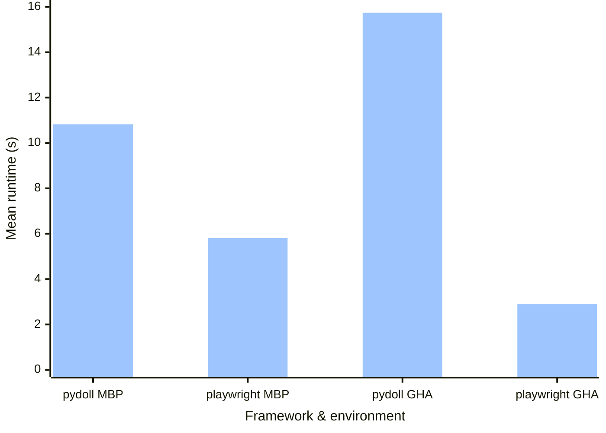

<!-- markdownlint-disable MD013 line-length -->
<!-- markdownlint-disable MD033 no-inline-html -->

Bottom line up front:

**Does pydoll deliver on speed?** Perhaps under certain circumstances. It would seem that
the ones I tested `pydoll` under for this article aren't said circumstances. Online
conversations about the library suggest it may be of use for those more
interested in web-scraping than in end-to-end tests.  

**Does pydoll deliver on ergonomics?** Not at the time of writing. Code snippets comparing
and contrasting `pydoll` tests with their `Playwright` equivalent ought to make this
evident later in this article.

---

End-to-end tests are to the programmer what candlelight is to the moth. Tantalising.
A bright polestar. Get a whisker too close and they'll burn you alive.

Admittedly, unless you're writing end-to-end tests for an oil refinery there won't be any
_actual_ conflagrations. Yet I know from first-hand experience how easy it is to sacrifice
hours of your life on the pyre of debugging this kind of test.

Naturally, when I came across the <a href="https://github.com/autoscrape-labs/pydoll" target="_blank">pydoll</a>
project I had to take the bait and see how easy it was to integrate into a Django project
and whether it lived up to the promises it made.

  

    <h5 class="card-title"><i class="bi bi-github me-2"></i>GitHub repositories</h5>
    

    The full code for the snippets mentioned in this article & used to benchmark pydoll vs
    Playwright using a Django project are available on GitHub at <a href="https://www.github.com/albertomh/django-e2e-benchmarks" target="_blank">albertomh/django-e2e-benchmarks</a>
    

    

    That repo uses my Django project template, <code>djereo</code>: read more about it in  <a href="https://www.albertomh.com/2025/pycliche-and-djereo">this article</a>
    or get the code from GitHub: <a href="https://www.github.com/albertomh/djereo" target="_blank">albertomh/djereo</a>
    

  

The recipe for this article is as follows:

1. Generate a new Django project with `djereo`.
1. Add a dash of `Playwright` end-to-end tests.
1. Balance with a glug of `pydoll` tests.
1. Bring to the boil and measure performance.
1. Simmer and draw conclusions.

You can step through the <a href="https://github.com/albertomh/django-e2e-benchmarks/commits/main/" target="_blank">repo's commit history</a>
to see the first three steps.
The end-to-end tests will exercise the following paths:

- Smoke-test the homepage and navigation.
- Test signing up to a new account.
- Test logging in and out.

Both end-to-end test suites evaluate the same user journeys. They have been written to be
as idiomatic as possible within each framework while trying to deviate as little as possible
from each other, particularly in any steps that could affect performance. You can find
both test suites in the repo's <a href="https://github.com/albertomh/django-e2e-benchmarks/tree/main/tests_e2e" target="_blank">tests_e2e/</a>
directory.

Now, to present the findings of step 4, after which I will dig into quirks and pain points
I stumbled upon in performing this exercise.

## Apparatus & versions

Performance was measured in two environments: locally on a MacBook Pro (MBP), and in a hosted
Continuous Integration environment on GitHub Actions pipelines (GHA).

**MBP:** 2021 MacBook Pro, `macOS 15.6`, M1 Pro processor, 16GB RAM. Chrome v140  
**GHA:** GitHub Actions (free tier), `ubuntu-24.04` runner, 4 vCPU, 16GB RAM. Chromium v140  
**pydoll:** version 2.8.0  
**Playwright:** using version 1.55.0 via `pytest-playwright` 0.7.0  

All tests ran in headed mode locally, and headlessly in CI.

## Performance results

The runtimes reported by `pytest` were recorded across ten runs of the suite for each
environment/framework combination. The following table and chart show the average runtime
and standard deviation for each:

<table class="table mb-3 font-monospace">
    <caption style="font-size: 14px">All figures in seconds</caption>
    <thead>
        <tr class="text-center">
            <th></th>
            <th colspan="2">pydoll</th>
            <th colspan="2">playwright</th>
        </tr>
    </thead>
    <tbody>
        <tr class="text-end fw-bold">
            <td></td>
            <td>mean</td>
            <td>std. dev.</td>
            <td class="ps-4">mean</td>
            <td>std. dev.</td>
        </tr>
        <tr class="text-end">
            <td class="fw-bold">MBP</td>
            <td>10.82</td>
            <td>0.40</td>
            <td>5.81</td>
            <td>1.84</td>
        </tr>
        <tr class="text-end">
            <td class="fw-bold">GHA</td>
            <td>15.74</td>
            <td>2.98</td>
            <td>2.90</td>
            <td>0.03</td>
        </tr>
    </tbody>
</table>

Besides being slower on average, `pydoll` runtimes fluctuated more, with `Playwright`
runtimes showing tighter clustering. In CI, for instance, their respective spreads were of
<samp>11.60s</samp> & <samp>0.07s</samp>.

## Pydoll background

`pydoll` has been around for less than a year at the time of writing. It's a newer library
and doesn't have a behemoth backing it like `Playwright` does with Microsoft.

Since development started in late 2024, `pydoll` has had two major versions: 1.0.0 earlier
in 2025, and 2.0.0 in June.

One of `pydoll`'s main selling points is the fact that it's built atop the Chrome DevTools
Protocol (CDP). You can read a nicely accessible CDP deep-dive in <a href="https://pydoll.tech/docs/deep-dive/cdp/" target="_blank">pydoll's documentation</a>.
This tighter integration that does away with the need for WebDrivers sounded exciting,
though it was ultimately undermined by the performance comparison above, plus the pain
points listed below.

## Pydoll pain points

The amount of code that each library required me to write to arrive at the same result is
the most immediately appreciable difference between the two. Measured using `tokei`, the
test suite written with `pydoll` contains a staggering 40% more lines of code than the
`Playwright` one (`conftest.py` plus test modules).

### Limited to Chromium

The most obvious limitation `pydoll` imposes on the user is that tests may only run against
Chromium browsers (Chrome & Edge only!).  
This is due to it being based on the CDP, though `Playwright` is more versatile since it
can also run against Firefox & WebKit, while still providing access to Chromium internals
via <a href="https://playwright.dev/docs/api/class-cdpsession" target="_blank">CDPSession</a>.

### Missing built-ins

In my (admittedly limited) experience, `pydoll` suffers from a lack of built-ins that one
may reasonably expect from an end-to-end framework and which, crucially, `Playwright` does
provide.

The most jarring example of this was having to roll my own `wait_for_url()` (nine lines of
code) vs `Playwright`'s one-liner: `expect(self.page).to_have_url(f"{BASE_URL}/")`.

  
<i class="bi bi-plus-circle-fill me-2"></i>Click to expand my pydoll wait_for_url helper

  <pre class="language-python">
    <code class="language-python">
async def wait_for_url(
    tab, expected_url: str, timeout: float = 5.0, interval: float = 0.05
):
    deadline = asyncio.get_event_loop().time() + timeout
    while True:
        current_url = await tab.current_url
        if current_url == expected_url:
            return
        if asyncio.get_event_loop().time() &gt; deadline:
            raise TimeoutError(
                f"Timed out waiting for URL {expected_url}, last seen {current_url}"
            )
        await asyncio.sleep(interval)</code>
  </pre>

### Flaky built-ins

The idiomatic way of having `pydoll` fill out a form field is with `insert_text()`.
However, I found this flaky, requiring me to turn to `type_text()` instead. This was
significantly slower as it simulates a user typing out a string. Being Chromium-only,
I expected tighter integration that would enable performance in something as commonplace
as manipulating `<input>`s.

### Lacking documentation

Following on from the above, `insert_text()` started working as I'd expect it to only by
first issuing a `click()` on the relevant element. The need to do this was not evident
from the examples in the documentation.  
I mention this to illustrate what I think is a set of documentation with good intentions
(and a decent API reference & Deep Dives) but could do with more guides. Perhaps
identifying needs via <a href="https://diataxis.fr/" target="_blank">diátaxis</a> could
help contributors structure and flesh out the docs.

Beyond the official docs, adoption across the Open Source community remains low at the
time of writing. Meaning there's a reduced number of examples or good practices to crib. A
<a href="https://grep.app/search?q=pydoll" target="_blank">search for pydoll on grep.app</a>
returns few results, with the overwhelming majority (89%) being hits on the
`autoscrape-labs/pydoll` repo itself.

## Conclusion

Can we say that `pydoll` keeps it promise on speed? No, at least not under the conditions
presented here, conditions which I believe to be archetypal of the needs of teams running
end-to-end tests against webapps.

`pydoll` may well have its uses when scraping, and as ergonomics are polished and its
adoption increases it'll find its place in the pantheon of end-to-end testing frameworks.
For now, I'll stick to `Playwright`.

## Ideas for improvement

It'd be nice to further develop the <a href="https://www.github.com/albertomh/django-e2e-benchmarks" target="_blank">albertomh/django-e2e-benchmarks</a>
repo so that, rather than running benchmarks manually, these are run in daily GitHub
Actions pipelines.
This would provide a foundation to automate testing new versions of `pydoll` &
`Playwright` as they are released, and generate daily performance reports.

  

    <h5 class="card-title"><i class="bi bi-github me-2"></i>End-to-end tests in <code>djereo</code></h5>
    

    Writing this article has motivated me to add a minimal end-to-end test suite (and
    related configuration) so that <code>Playwright</code> tests are available out-of-the-box
    in all <code>djereo</code> projects. Available in <a href="https://github.com/albertomh/djereo/releases/tag/v3.9.0" target="_blank">v3.9.0</a>
    and later.
    

  

### Tip: cache browser installs in GitHub Actions

When running the `Playwright` tests in CI I initially suffered through longer-than-necessary
pipeline runtimes. The culprit was the repeated installation of Chromium in each run. This
can be easily cached with:

<pre class="language-yaml">
<code class="language-yaml">
# .github/workflows/e2e.yaml
- name: Cache Playwright browsers
  id: cache-playwright
  uses: actions/cache@v4
  with:
    path: ~/.cache/ms-playwright
    key: playwright-${{ runner.os }}-chromium

- if: ${{ steps.cache-playwright.outputs.cache-hit != 'true' }}
  run: uv run playwright install --with-deps chromium
</code>
</pre>

Doing so allowed me to halve the runtime of the `Playwright` GitHub Actions job (<a href="https://github.com/albertomh/django-e2e-benchmarks/actions/runs/17457023471/job/49572953211?pr=6" target="_blank">before</a>
vs <a href="https://github.com/albertomh/django-e2e-benchmarks/actions/runs/17486897724/job/49667839047?pr=7" target="_blank">after</a>).
