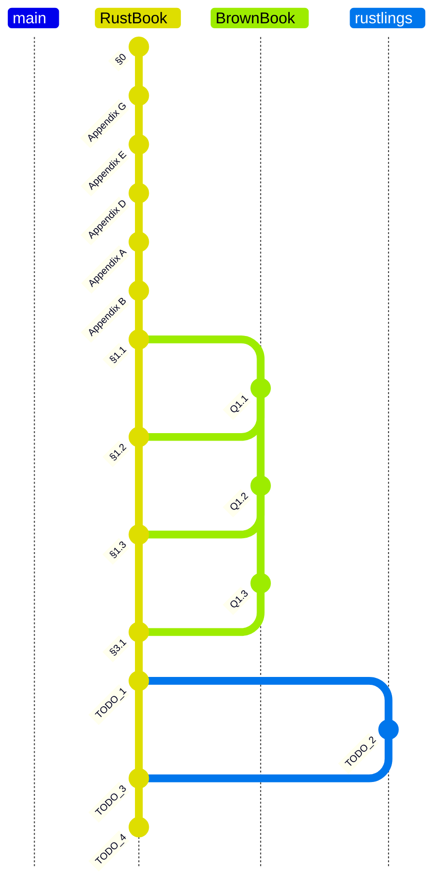

```mermaid
gitGraph TB:

    branch RustBook
    commit id: "§0"
    commit id: "Appendix G"
    commit id: "Appendix E"
    commit id: "Appendix D"
    commit id: "Appendix A"
    commit id: "Appendix B"
    commit id: "§1.1"
    branch BrownBook
    checkout BrownBook
    commit id: "Q1.1 "
    checkout RustBook
    merge BrownBook type: NORMAL id:"§1.2"
    checkout BrownBook
    commit id: "Q1.2"
    checkout RustBook
    merge BrownBook type: NORMAL id:"§1.3"
    checkout BrownBook
    commit id: "Q1.3"
    checkout RustBook
    merge BrownBook type: NORMAL id:"§3.1"

    commit id: "TODO_1"
    branch rustlings
    commit id: "TODO_2"
    checkout RustBook
    merge rustlings type: NORMAL id: "TODO_3"
    commit id: "TODO_4"

```
